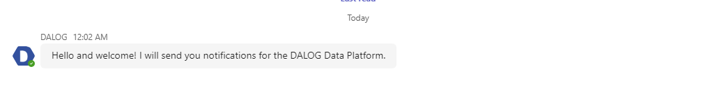
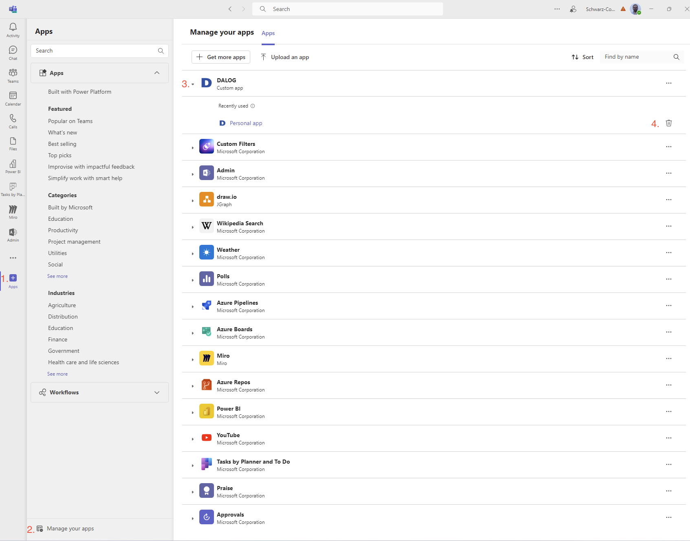

# DALOG Data Platform Teams Notifications

## 0 - Prerequisites

Ensure that you have activated Teams notifications for your account. To do so, click on your account icon in the very far top right corner and select `Update notification settings`.

 Switch to the `Teams`-tab and ensure that either `Enabled` or `Selected` with the corporation and / or companies and / or projects and / or machines you want to receive notifications for is active. Click on `Continue` button.
 
 
 
 Review your changes and click on the `Save Changes` button to activate your changes.

## 1 - Download the DALOG Data Platform Teams Notifications app

You'll need to download once the DALOG Data Platform Teams notifications app by clicking [here](ddp-teams-1.0.0.zip). Take note where you downloaded it to, you'll need it in the next step.

## 2 - Install the DALOG Data Platform Teams Notifications app

You'll need to install once he DALOG Data Platform Teams notifications app. To do so, please open the Microsoft Teams application and click on the `Apps` button on the bottom of the left menu. Click on `Manage your apps` on the left bottom and select `Upload an app` in the top middle.

A dialog will be shown with three different possibilties how to Install the DALOG Data Platform Teams Notifications app.

1. **Upload a custom app**:
If you want to receive DALOG Data Platform Teams Notifications just for your account, select this option. The remainder of this manual will follow this selection.
1. **Upload an app to your org's app catalog**: 
If you want to make the DALOG Data Platform Teams Notifications app available to all the Teams users in your company, please choose this option. This requires you to be a Microsoft Teams administrator in your M365 tenant. If you're having issues installing the app for all your users, please contact support@dalog.net.
1. **Submit an app to your org**:
If you would like your IT department to make the the DALOG Data Platform Teams Notifications app available to you and all other Teams users in your company, select this option to notify your Microsoft Teams administrator.

We assume that you want to install the DALOG Data Platform Teams Notifications just for your account and have clicked on `Upload a custom app`. In the file dialog, select the `.zip` file you have downloaded in step 1. Click on the `Add` button to finish the installation of the app.

You will be automatically redirected to the chat window of the DALOG Data Platform Teams Notifications app, and it will great you. Congratulations, you have installed the app successfully!

## 3 - The DALOG Data Platform Teams Notifications app

The DALOG Data Platform Teams Notifications app main purpose is to notify you about alerts in your measured data, and updates or new content in the DALOG Machine CV of your plants, projects and machines. Currently, you cannot interact with it in any other way, but please stay tuned as this is a feature already on our roadmap 😊.

## 4 - Uninstalling the DALOG Data Platform Teams Notifications app

To remove the DALOG Data Platform Teams Notifications app from your Teams installation, click on the `Apps` button in the bottom on the menu in the left. Select `Manage your apps` in the bottom left corner. Click on the `DALOG` app to expand its properties. On the very right side you'll see now a trash icon to click on.

Click on the `Remove` button. You have now succesfully removed the DALOG Data Platform Teams Notifications app. Please support us on improving this product by sending us feedback to support@dalog.net why you have removed this app. Many Thanks in advance!

